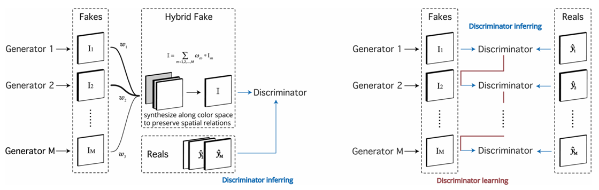

# Generating Sequence of Handwritten Digits Which Is the Sum of a Number

## Description
This project focuses on generating a sequence of handwritten digits that sum up to a given integer. The goal is to generate a sequence of images, each representing a single handwritten digit, where the sum of the digits equals a specified target sum. The output is a series of images of handwritten digits, generated using advanced machine learning techniques.

### Input:
- **Sum**: An integer representing the target sum.
- **Sequence Length**: An integer specifying how many digits are in the generated sequence.

### Output:
- **Generated Sequence**: A sequence of images representing handwritten digits that sum up to the given target number.

## Approach

### One to Many Conditional GANs (CGANs)
The One to Many CGANs architecture, proposed by Jing Liao, is utilized as the first approach in this project. It involves training a conditional Generative Adversarial Network (GAN) where multiple generators takes a target sum and generates a corresponding sequence of digits and one discriminator. This method allows for the generation of multiple possible sequences that sum up to the same number, demonstrating the flexibility of the model in generating different handwriting styles and sequences. **However**, this method has a drawback which is there is no correlation between the generators' outputs, hence the digits don't add up to the correct target sum.

<p align="center">
  
</p>

- **Generators**: Takes the target sum and sequence length as input, generating a sequence of digit images.
- **Discriminator**: Evaluates whether the generated sequence looks like real handwritten digits and if it satisfies the sum condition.

### LSTM - CGANs
The LSTM - CGAN approach, developed by me, performes better than the One to Many CGANs by introducing Long Short-Term Memory (LSTM) units into the conditional GAN framework. This allows the model to generate a sequence of digits with better sequential consistency and capture the dependencies between the digits in the sequence. In this architecture, one LSTM model is connected to many CGANs models.

In this approach:
- **LSTM Layers**: These layers help the generator maintain context between digits in the sequence, improving the flow and coherence of the generated sequence.
- **CGAN Frameworks**: The core conditional GAN structure is maintained, with the generator producing digit images based on the target sum and sequence length, while the discriminator ensures both realism and correctness of the sum.

### Benefits of LSTM - CGANs
- **Sequential Consistency**: The LSTM units improve the temporal relationship between digits, making the generated sequences more coherent.
- **Improved Accuracy**: This method results in more accurate sequences of digits, where the sum condition is more reliably met.

## Installation
To get started, clone the repository and install the required dependencies:

```bash
git clone https://github.com/yourusername/handwritten-digit-sequence-generator.git
cd handwritten-digit-sequence-generator
pip install -r requirements.txt
